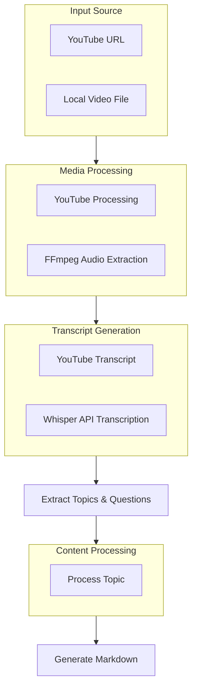

# Software Engineering Podcast Explainer

## Project Requirements
This project takes either a YouTube podcast URL or a local video file, extracts the transcript, identifies key technical topics and Q&A pairs, explains them for junior software engineers, and generates a Markdown report with the results.

## Utility Functions

1. **LLM Calls** (`utils/call_llm.py`)

2. **Media Processing** (`utils/media_processor.py`)
   - Process YouTube URLs: Get video title, transcript and thumbnail
   - Process local files: Extract audio and generate transcript using Whisper API
   - Common interface for both sources

3. **Markdown Generator** (`utils/markdown_generator.py`)
   - Create formatted report with topics, Q&As and technical explanations

## Flow Design

The application flow consists of several key steps organized in a directed graph:

1. **Media Processing**: 
   - For YouTube: Extract transcript and metadata from URL
   - For local files: 
     - Extract audio using ffmpeg
     - Generate transcript using Whisper API
2. **Topic Extraction**: Identify key technical topics (max 5)
3. **Question Generation**: For each topic, generate technically focused questions (3 per topic)
4. **Topic Processing**: Batch process each topic to:
   - Refine the topic title for technical clarity
   - Structure the questions for software engineering context
   - Generate detailed technical answers
5. **Markdown Generation**: Create final technical documentation

### Flow Diagram



## Data Structure

The shared memory structure will be organized as follows:

```python
shared = {
    "source_info": {
        "type": str,           # "youtube" or "local"
        "location": str,       # YouTube URL or file path
        "title": str,          # Video title or filename
        "transcript": str,     # Full transcript
        "thumbnail_url": str,  # Thumbnail URL (YouTube only)
        "video_id": str,       # Video ID (YouTube only)
        "duration": float,     # Duration in seconds
    },
    "topics": [
        {
            "title": str,              # Original topic title
            "rephrased_title": str,    # Clarified topic title
            "questions": [
                {
                    "original": str,      # Original question
                    "rephrased": str,     # Clarified question
                    "answer": str         # ELI5 answer
                },
                # ... more questions
            ]
        },
        # ... more topics
    ],
    "markdown_output": str  # Final Markdown content
}
```

## Node Designs

### 1. ProcessMediaSource
- **Purpose**: Process input source (YouTube URL or local file)
- **Design**: Regular Node with source-specific handlers
- **Data Access**: 
  - Read: Source location from shared store
  - Write: Source information to shared store
- **Implementation Details**:
  - YouTube handler: Uses YouTube API for metadata and transcript
  - Local file handler: 
    - Uses ffmpeg to extract audio (-y -i input.mp4 -vn -acodec pcm_s16le -ar 16000 -ac 1 output.wav)
    - Uses Whisper API for transcript generation
  - Common interface for both source types

### 2. ExtractTopicsAndQuestions
- **Purpose**: Extract interesting topics from transcript and generate questions for each topic
- **Design**: Regular Node (no batch/async)
- **Data Access**:
  - Read: Transcript from shared store
  - Write: Topics with questions to shared store
- **Implementation Details**:
  - First extracts up to 5 interesting topics from the transcript
  - For each topic, immediately generates 3 relevant questions
  - Returns a combined structure with topics and their associated questions

### 3. ProcessTopic
- **Purpose**: Batch process each topic for rephrasing and answering
- **Design**: BatchNode (process each topic)
- **Data Access**:
  - Read: Topics and questions from shared store
  - Write: Rephrased content and answers to shared store

### 4. GenerateHTML
- **Purpose**: Create final HTML output
- **Design**: Regular Node (no batch/async)
- **Data Access**:
  - Read: Processed content from shared store
  - Write: HTML output to shared store

